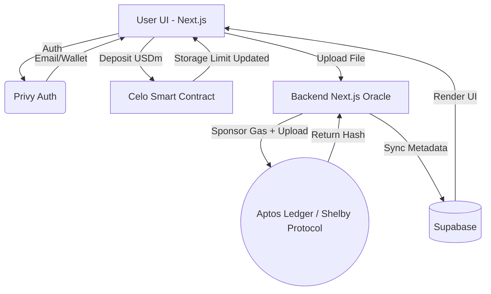

<div align="center">
  
  <h1>MiniDrive</h1>
  <p><strong>The First Decentralized, Gasless DePIN Storage Network for Web3 & Web2</strong></p>
  
  [](https://opensource.org/licenses/MIT)
  [](https://celo.org/)
  [](https://aptosfoundation.org/)
  [](https://nextjs.org/)
  
  <p>
    <a href="#-vision">Vision</a> •
    <a href="#-architecture">Architecture</a> •
    <a href="#-features">Features</a> •
    <a href="#-quick-start">Quick Start</a>
  </p>
</div>

---

## 🌍 Vision

**MiniDrive** bridges the gap between complex decentralized storage (DePIN) and mass-market consumer applications. Traditional Web3 storage solutions require users to manage private keys, bridge tokens, and manually pay gas fees for every upload. 

MiniDrive abstracts all of this complexity away. Using a hybrid Celo-Aptos architecture, users can securely store, encrypt, and access their files on a distributed network while enjoying a frictionless, Apple-like UX. 

Whether you are a Web3 native using **Opera MiniPay** or a Web2 user logging in with an email, MiniDrive just works.

---

## ⚡ Features

### 1. Gasless Web2 & Web3 Onboarding
Powered by **Privy Embedded Wallets**, users can authenticate seamlessly via Email or injected Web3 wallets (MiniPay/MetaMask). Web2 users receive an invisible Celo wallet in the background, allowing them to interact with smart contracts without ever writing down a seed phrase.

### 2. Pay-Once DePIN Storage (Celo USDm)
Say goodbye to monthly Google Drive subscriptions. Users deposit **Celo USDm** into the `MiniDriveEscrow.sol` smart contract to unlock permanent storage bandwidth. 
* *Current Rate: 1 USDm = 5GB of decentralized storage.*

### 3. Oracle-Sponsored Uploads
To prevent users from needing Aptos tokens (APT) to pay for storage registration, our Next.js backend acts as an **Oracle**. The backend Master Wallet automatically sponsors the micro-gas fees required to erasure-code the files and register them on the Shelby/Aptos ledger.

### 4. Cross-Device Vault Syncing
Your encrypted file hashes and metadata are securely synced across all your devices using **Supabase**, ensuring your DePIN Vault is always up to date whether you are on mobile, tablet, or desktop.

---

## 🏗 Architecture

MiniDrive orchestrates three distinct networks to provide a seamless user experience.



---

## 🚀 Quick Start

### 1. Prerequisites
- **Node.js** `>= 18.0.0`
- **Aptos Wallet** (Funded with Testnet/Mainnet APT for the Backend Oracle)
- **Supabase Project** (For metadata syncing)
- **Privy App ID** (For authentication)

### 2. Environment Setup
Clone the repository and create a `.env.local` file in the root directory:

```env
# Authentication
NEXT_PUBLIC_PRIVY_APP_ID=your_privy_id

# Metadata Database
NEXT_PUBLIC_SUPABASE_URL=your_supabase_url
NEXT_PUBLIC_SUPABASE_ANON_KEY=your_supabase_key

# Backend Oracle Master Key (DO NOT EXPOSE TO CLIENT)
APTOS_PRIVATE_KEY=your_aptos_private_key
```

### 3. Installation
Install dependencies and run the development server:

```bash
npm install
npm run dev
```

Open [http://localhost:3000](http://localhost:3000) with your browser to see the result.

---

## 📜 Smart Contracts

The storage escrow logic is handled by `MiniDriveEscrow.sol`.

| Network | Contract Address | Currency |
|---------|------------------|----------|
| Celo Alfajores (Testnet) | `0x...` *(Add your deployed address here)* | USDm |

To deploy or verify the contract locally:
```bash
npx hardhat compile
npx hardhat run scripts/deploy.js --network alfajores
```

---

## 🔒 Security & Privacy
MiniDrive does not store your files on centralized AWS servers. When a file is uploaded, it is broken down into cryptographic commitments and erasure-coded. The resulting blobs are seeded across independent, decentralized nodes. Even if a portion of the nodes go offline, the file can be perfectly reconstructed.

---

## 🤝 Contributing
We welcome contributions from the community! If you'd like to help improve MiniDrive:
1. Fork the repository
2. Create your feature branch (`git checkout -b feature/AmazingFeature`)
3. Commit your changes (`git commit -m 'Add some AmazingFeature'`)
4. Push to the branch (`git push origin feature/AmazingFeature`)
5. Open a Pull Request

---

## 📄 License
This project is licensed under the MIT License - see the [LICENSE](LICENSE) file for details.
